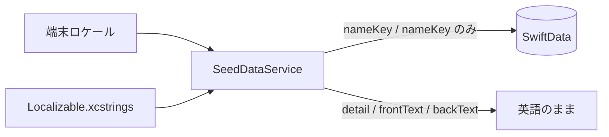

# Memory Spots: 多言語対応 実装計画書

Last updated: 2026-06-07

## 1. 目的

Memory Spots を主要先進国＋インドの市場向けにローカライズする。MVP の範囲を超える大規模な国際化基盤は作らず、ユーザーが日常操作で触れる文字列に限定して対応する。

## 2. 対象言語

| コード | 言語 | 状態 |
|--------|------|------|
| `en` | 英語 | ソース言語（既存） |
| `ja` | 日本語 | 既存（一部穴あり） |
| `de` | ドイツ語 | 新規 |
| `fr` | フランス語 | 新規 |
| `it` | イタリア語 | 新規 |
| `es` | スペイン語 | 新規 |
| `ko` | 韓国語 | 新規 |
| `hi` | ヒンディー語（インド） | 新規 |

## 3. スコープ

### 3.1 対象（今回やる）

- **アプリ UI 文字列** — 画面ラベル、ボタン、空状態、チュートリアル、Help、確認ダイアログ、アクセシビリティラベル
- **権限文言** — カメラ / 位置情報 / 写真ライブラリ（`InfoPlist.xcstrings`）
- **シードのアルバム名・テーマ名のみ** — 初回投入時に端末言語で保存

### 3.2 対象外（今回やらない）

- シードのノート本文（`frontText` / `backText`）
- シードの写真タイトル
- シードのアルバム説明文（`detail`）
- 既存インストール済みデータの再翻訳・マイグレーション
- App Store Connect のメタデータ（説明文・キーワード・スクリーンショット文言）
- App Store スクリーンショット自動化テストのロケール対応

## 4. 現状（2026-06-07 時点）

### 4.1 完了済み

| 項目 | ファイル | 内容 |
|------|----------|------|
| プロジェクト設定 | [`project.yml`](../project.yml) | `knownRegions` に 8 言語を追加 |
| シードのローカライズ基盤 | [`MindPalace/Services/SeedDataService.swift`](../MindPalace/Services/SeedDataService.swift) | `themeKey` 化、`nameKey` + `String(localized:)` でアルバム名・テーマ名を解決 |
| UI 翻訳データ | [`MindPalace/Localizable.xcstrings`](../MindPalace/Localizable.xcstrings) | `de` / `fr` / `it` / `es` / `ko` / `hi` を追加 |
| 権限翻訳データ | [`MindPalace/InfoPlist.xcstrings`](../MindPalace/InfoPlist.xcstrings) | 上記 6 言語を追加 |
| シード名のカタログ登録 | `Localizable.xcstrings` | `Gotanda Station East Route` などを登録 |
| 未抽出 UI 文字列 | `Localizable.xcstrings` | Help 画面、一部削除確認などを登録 |
| 日本語の穴埋め | `Localizable.xcstrings` | 削除確認 3 件、`Search albums` などを補完 |
| Xcode プロジェクト反映 | `MindPalace.xcodeproj` | `xcodegen generate` 実行済み |
| ビルド・起動検証 | — | XcodeBuildMCP で iPhone 17 Simulator ビルド・起動成功 |

### 4.2 未完了

| 項目 | ファイル | 内容 |
|------|----------|------|
| ロケール別 UI スポット確認 | — | `de` / `fr` / `ko` / `hi` の実機目視確認は未実施 |

**進捗目安: 約 90%**（実装・ビルド完了、ロケール別目視確認のみ未実施）

## 5. 技術方針

### 5.1 基盤

- ソース言語: `en`
- String Catalog: `Localizable.xcstrings`（UI）、`InfoPlist.xcstrings`（権限・アプリ名）
- SwiftUI / `String(localized:)` / `LocalizedStringKey` による既存連携を維持
- `project.yml` の `knownRegions` を正とし、`xcodegen generate` で反映

### 5.2 シードデータのローカライズ



- アルバム名・テーマ名はカタログキー（英語文字列）を `nameKey` に保持
- テーマ紐付けは表示名ではなく **安定 `themeKey`**（例: `saa-c03-review`）で行う
- 初回投入時（`stableId` が未存在）のみ端末言語で保存
- 既存ユーザーのデータは変更しない

### 5.3 翻訳方針

[`GLOBAL_UX_IMPROVEMENT_PROPOSAL.md`](GLOBAL_UX_IMPROVEMENT_PROPOSAL.md) に準拠:

- UI は短く保つ
- コア用語を可能な限り統一:
  - Memory Map / Albums / Themes / Notes / Waypoints
- 複数形・引数付き文字列は iOS 形式を維持（例: `%1$lld photos`）
- 技術略語（VPC, NAT 等）はシードノート対象外のため今回は触らない

### 5.4 カタログに翻訳を追加しないキー（シード本文のみ）

以下は `ja` のみ既存。新規 6 言語は追加しない:

- `A sample memory set using familiar everyday spaces...`
- `A5 pocket notebook for ideas.`
- `Apples`, `Bread`, `Coffee Beans`, `Dog Food`, `Milk`, `Notebook`, `Water Bottle`
- `Bring water bottle for hydration.` など買い物リスト系の説明文
- `Desk Setup`, `Local Park`, `My Room`, `My Room & Park`, `Grocery List`

## 6. 実装ステップ

### Step 1: 翻訳データの一括適用

**対象ファイル:** `Localizable.xcstrings`

1. 既存 UI キー（約 100 件）に `de` / `fr` / `it` / `es` / `ko` / `hi` を追加
2. 未登録 UI キーを追加して翻訳:
   - `Delete Album`, `Delete Theme`, `Delete Image`, `Edit`, `Review`, `Theme`
   - `Search albums or tags`, `Current Location`, `Clear filters`, `Open photo`
   - `Move Image Earlier`, `Move Image Later`, `Album Details`, `Photo Notes`, `Help`
   - Help 画面のタイトル・説明・各ポイント（計 16 件程度）
3. シード名キーを追加して翻訳:

| キー | 種別 |
|------|------|
| `Gotanda Station East Route` | アルバム |
| `Daruma Room Route` | アルバム |
| `Elephant Plaza Route` | アルバム |
| `Indoor Study Route` | アルバム |
| `SAA-C03 Review` | テーマ |
| `Spanish Grammar` | テーマ |
| `Vocab Recall` | テーマ |
| `Speaking` | テーマ |
| `ML Finals` | テーマ |
| `Board Review` | テーマ |

4. 日本語の未翻訳キーを補完:
   - `This will delete the album, its themes, photos, and notes.`
   - `This will delete this image and its notes.`
   - `This will delete this theme and its notes.`
   - `No albums match your search.`
   - `Search albums`

**作業量目安:** 約 110 キー × 6 言語 ≒ 660 エントリ + `ja` 穴埋め

### Step 2: 権限文言の翻訳

**対象ファイル:** `InfoPlist.xcstrings`

| キー | 内容 |
|------|------|
| `CFBundleDisplayName` | Memory Spots（ブランド名のため各言語で同一） |
| `CFBundleName` | 同上 |
| `NSCameraUsageDescription` | カメラ利用目的 |
| `NSLocationWhenInUseUsageDescription` | 位置情報利用目的 |
| `NSPhotoLibraryUsageDescription` | 写真ライブラリ利用目的 |

各キーに `de` / `fr` / `it` / `es` / `ko` / `hi` を追加。

`project.yml` の `Info.plist` 英語文言はフォールバックとして維持。

### Step 3: プロジェクト反映

```sh
xcodegen generate
```

`MindPalace.xcodeproj` の `knownRegions` が 8 言語になることを確認。

### Step 4: ビルド・ロケール検証

```sh
xcodebuild \
  -project MindPalace.xcodeproj \
  -scheme MindPalace \
  -destination 'platform=iOS Simulator,name=iPhone 17 Pro' \
  build
```

**スポットチェック（優先ロケール）:**

| ロケール | 確認項目 |
|----------|----------|
| `de` | ナビタイトル・テーマチップの長文はみ出し |
| `fr` | Help シート、削除確認ダイアログ |
| `ko` | チュートリアル、空状態メッセージ |
| `hi` | デーヴァナーガリ文字の表示、初回シードのアルバム名 |
| `ja` | 削除確認など穴だったキー |

**初回シード確認:**

- 端末言語が `de` 等のとき、アルバム名・テーマ名が翻訳されていること
- ノート本文は英語のままであること

## 7. 変更ファイル一覧

| ファイル | 変更内容 |
|----------|----------|
| [`project.yml`](../project.yml) | `knownRegions` 拡張（済） |
| [`MindPalace/Services/SeedDataService.swift`](../MindPalace/Services/SeedDataService.swift) | `themeKey` 化、名前のローカライズ（済） |
| [`MindPalace/Localizable.xcstrings`](../MindPalace/Localizable.xcstrings) | UI + シード名の 6 言語翻訳（済） |
| [`MindPalace/InfoPlist.xcstrings`](../MindPalace/InfoPlist.xcstrings) | 権限の 6 言語翻訳（済） |
| `MindPalace.xcodeproj/project.pbxproj` | `xcodegen` による `knownRegions` 反映（済） |

## 8. リスクと対策

| リスク | 対策 |
|--------|------|
| テーマ名ローカライズでシード紐付けが壊れる | `themeKey` による安定参照（実装済み） |
| 翻訳量が多く品質がばらつく | コア用語表を先に固定。UI ラベル → シード名の順で翻訳 |
| 独語・ヒンディー語で UI がはみ出す | 検証で発見した箇所のみ `lineLimit` や短縮訳で最小修正 |
| カタログ未登録の UI 文字列が英語のまま | Help 等の未登録キーを Step 1 で明示的に追加 |
| `Info.plist` と `InfoPlist.xcstrings` の二重管理 | ローカライズは `InfoPlist.xcstrings` を正とする |

## 9. 完了条件

- [x] `Localizable.xcstrings` に UI + シード名の 6 言語翻訳が入っている
- [x] `InfoPlist.xcstrings` に権限の 6 言語翻訳が入っている
- [x] `xcodegen generate` 後、`knownRegions` が 8 言語
- [x] シミュレータビルドが成功する
- [ ] `de` / `fr` / `ko` / `hi` で UI・権限・初回シード名をスポット確認済み

## 10. 将来の拡張（今回のスコープ外）

- App Store メタデータのローカライズ
- シードノート本文の翻訳
- ユーザー作成コンテンツの翻訳
- スクリーンショット自動化のロケール対応
- 追加言語（`nl`, `pt` など）
