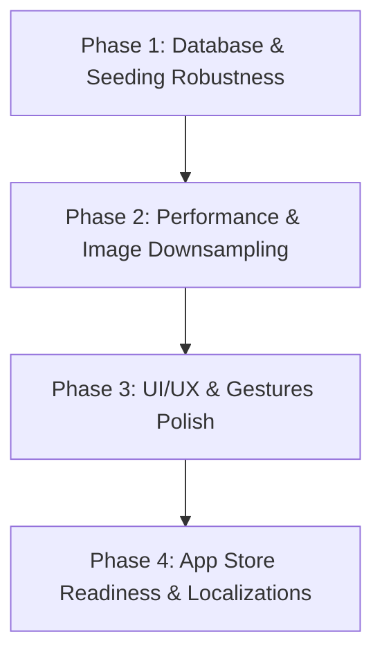

# Mind Palace: Comprehensive Code & UI/UX Review Report

This report presents a thorough code and design review of **Mind Palace** from three professional perspectives: **Senior UI/UX Engineer**, **Senior Backend/Infrastructure Engineer**, and **Senior Frontend/iOS Engineer**. It outlines the current issues, architectural gaps, and specific tasks required to make the app globally usable, visually premium, and fully ready for App Store submission.

---

## 1. Senior UI/UX Engineer Review
**Focus: Human Interface Guidelines (HIG) compliance, international usability, gestures, and tactile interactions.**

### 🔍 Current Findings
1. **Visual Recall Gap in Review Mode (`ReviewView`)**:
   * **Issue**: The core concept of the "Method of Loci" relies on visual-spatial association (e.g., "remembering the blue sticky note next to the desk lamp"). However, in `ReviewView`, all notes are rendered as identical **yellow circles/dots** on the image. The user does not see the note's actual color, type (arrow, icon, text), or shape.
   * **Impact**: This breaks the visual association training. Users have to recall the text based on a generic dot, which defeats the purpose of custom visual markers.
2. **Missing Dark Mode Support**:
   * **Issue**: `PalaceStyle.swift` defines paper and ink colors using hardcoded light values. The app does not support Dark Mode.
   * **Impact**: If a user runs the app in system-wide Dark Mode, standard SwiftUI components (like forms and navigation bars) will default to dark while the custom panels remain light, causing high-contrast visual glitches.
3. **Clunky Note Creation Interface**:
   * **Issue**: Adding visual notes in `PhotoEditorView` requires tapping a bottom-bar Menu labeled "置く" (Place) and selecting from a list of text names.
   * **Impact**: This feels indirect and lacks visual representation of what the user is about to place.
4. **Lack of Modern Gestures**:
   * **Issue**: Card review in `ReviewView` uses static buttons ("覚えた", "微妙", "忘れた").
   * **Impact**: It feels like a legacy quiz app rather than a tactile iOS utility.

### 💡 Proposed Improvements
* **Synchronize Card Style in Review**: Update `ReviewView` to render a miniature version of the actual `MemoryItemView` (masking the front text until the answer is shown) instead of a simple yellow dot.
* **Support Dark Mode or Lock to Light Mode**:
  * *Option A*: Implement a beautiful Dark Mode theme (e.g., deep charcoal paper, golden ink) using semantic colors in Asset Catalogs.
  * *Option B*: If keeping it strictly paper-themed, force light mode window-wide by applying `.preferredColorScheme(.light)` at the root.
* **Tactile Review Gestures**: Implement Tinder-like swipe gestures on the review cards (e.g., swipe right to mark "Remembered", swipe left to mark "Forgot").
* **Visual Add-Palette**: Replace the text-based "Place" menu with a horizontal visual toolbar or bottom sheet showing the actual icons/shapes of the items (sticky, image, star, number, arrow).
* **Zoom/Pan Indicator**: Add a subtle visual cue (or onboarding tip) showing that double-tap to zoom/pan the place photo is available.

---

## 2. Senior Backend/Infrastructure Engineer Review
**Focus: Database performance (SwiftData), storage optimization, idempotency, and system reliability.**

### 🔍 Current Findings
1. **SwiftData Anti-Pattern: Manual Relationships (UUID Keys)**:
   * **Issue**: `MemoryPhoto`, `MemoryTheme`, and `MemoryItem` reference parent models using manual UUID properties (e.g., `setId: UUID`, `photoId: UUID`) instead of SwiftData `@Relationship` annotations.
   * **Performance Impact**: Operations like calculating note counts or filtering items require loading all database records into memory and filtering them in Swift:
     ```swift
     // MemorySetDetailView.swift: Runs on every UI redraw
     private var headerNoteCount: Int {
         let photoIds = Set(setPhotos.map(\.id))
         return items.filter { photoIds.contains($0.photoId) }.count
     }
     ```
     As the database grows to hundreds of memory items, this results in significant CPU/memory spikes and laggy screen transitions.
   * **Integrity Impact**: Manual cascade deletions in `HomeView.swift` and `MemorySetDetailView.swift` are fragile. If a developer adds a new model or relation and forgets to update the manual deletion block, orphan records will leak in the SQLite database.
2. **Localization Seeding Bug**:
   * **Issue**: `SeedDataService` checks for existing seed data by fetching a `MemorySet` where name matches the localized string:
     ```swift
     let localizedSetName = String(localized: "My Room & Park")
     var descriptor = FetchDescriptor<MemorySet>(predicate: #Predicate { $0.name == localizedSetName })
     ```
   * **Impact**: If a user runs the app in English, the set is saved as `"My Room & Park"`. If they later change their device language to Japanese and open the app, `localizedSetName` becomes `"マイプレイス（部屋と公園）"`. The check fails to find the existing set and seeds it *again*, creating duplicate sets and photos.
3. **Storage & Memory Overload (Unchecked Image Sizes)**:
   * **Issue**: When a user captures a photo via the camera or imports one from the library, `ImageStore.saveImage` saves the full-resolution image at 88% JPEG compression quality directly to disk.
   * **Impact**: Modern iPhones capture 12MP to 48MP images (15MB+ on disk, 100MB+ uncompressed in RAM). Loading multiple such full-res photos in a list or editor view will trigger Out-Of-Memory (OOM) app crashes.
4. **App Store Storage Violations**:
   * **Issue**: Photos are saved in `Application Support/PlacePhotos` without being excluded from iCloud backups.
   * **Impact**: Apple's Review Guidelines require that cached or non-critical files must not be backed up to iCloud. If the user's photos folder takes up gigabytes, Apple may reject the binary.

### 💡 Proposed Improvements
* **Refactor to SwiftData Relationships**: Redefine the models using `@Relationship(deleteRule: .cascade)` (e.g., `MemorySet` has `var photos: [MemoryPhoto]`, and `MemoryPhoto` has `var items: [MemoryItem]`). This lets the underlying CoreData SQLite engine optimize joins, counts, and automatically cascade-delete all dependent items/reviews safely.
* **Language-Independent Seeding**:
  * Add a `stableId: String?` property or similar persistent flag to `MemorySet`.
  * Check for seed data using this stable ID (e.g., `set.stableId == "default-seed-set"`) instead of relying on the localized name.
* **Image Downsampling**: Implement downsampling in `ImageStore` to resize all imported images to a maximum resolution (e.g., max 2048px on the longest edge) before converting to JPEG. This will reduce disk usage by ~90% and prevent OOM crashes.
* **Exclude Directories from iCloud Backup**: Exclude the `PlacePhotos` directory in `ImageStore.imagesDirectory()` from backup by setting the `isExcludedFromBackup` URL resource key.

---

## 3. Senior Frontend/iOS Engineer Review
**Focus: SwiftUI rendering performance, thread safety, localization completeness, and accessibility (a11y).**

### 🔍 Current Findings
1. **VoiceOver Accessibility Barrier (a11y)**:
   * **Issue**: In `MemoryItemView`, the accessibility label is hardcoded to just the item type's title:
     ```swift
     .accessibilityLabel(item.itemType.title)
     ```
   * **Impact**: For a visually impaired user, VoiceOver will only announce "付箋" (Sticky Note) or "アイコン" (Icon). The actual text of the note (`frontText`) is completely skipped, making the app unusable with VoiceOver.
2. **Main-Thread Disk I/O (UI Stutter)**:
   * **Issue**: `ImageStore.loadImage(named:)` reads the image directly from the filesystem synchronously:
     ```swift
     return UIImage(contentsOfFile: url.path)
     ```
     This function is called inside SwiftUI view bodies (like `PhotoRow` in list scroll views and map annotation pins).
   * **Impact**: Reading large images synchronously from flash storage on the main thread causes UI stuttering (dropped frames) during scrolls and map interactions.
3. **Global Code Smell**:
   * **Issue**: The utility function `aspectFitFrame` is declared as a global function at the bottom of `PhotoEditorView.swift`, but is reused in `TutorialView.swift` and `ReviewView.swift`.
   * **Impact**: Violates modular design principles and reduces code maintainability.
4. **Hardcoded UI Strings**:
   * **Issue**: Buttons like `Button("完了")`, `Button("キャンセル")`, and labels like `Text("現在のテーマ: \(theme.name)")` are hardcoded in views.
   * **Impact**: If the app is run in English, these elements will still display in Japanese.

### 💡 Proposed Improvements
* **Fix VoiceOver Labels**: Update accessibility labels to announce both the type and the content. For example:
  ```swift
  .accessibilityLabel(String(localized: "\(item.itemType.title): \(item.frontText)"))
  ```
* **Asynchronous Image Loading & Memory Caching**:
  * Create a simple image cache (`NSCache`) or a background image loader component.
  * Load images asynchronously for scroll rows and map pins to keep the UI running at a buttery-smooth 120 FPS (ProMotion).
* **Consolidate Geometry Helpers**: Create a dedicated file `Views/GeometryUtils.swift` and move `aspectFitFrame` inside it.
* **Complete Localization Extraction**: Scan the SwiftUI views and extract all remaining Japanese strings into `Localizable.xcstrings`.

---

## 4. App Store Shipment Readiness Checklist

Before submitting the app to the App Store, the following gaps must be closed:

| Category | Item | Current Status | Required Action |
| :--- | :--- | :--- | :--- |
| **Assets** | App Icon (1024x1024) | ❌ Missing | Add app icon set to `Assets.xcassets`. |
| **Assets** | Branded Launch Screen | ⚠️ Basic | Design a custom launch screen or keep the current clean style. |
| **Localization** | Info.plist Privacy Prompts | ⚠️ Only English | Localize the usage strings for Camera, Location, and Photo Library in an `InfoPlist.xcstrings` catalog (supporting Japanese and English). |
| **Legal** | Privacy Policy URL | ❌ Missing | Set up a hosting page for the App Privacy Policy. |
| **Legal** | EULA (Terms of Service) | ❌ Missing | Provide standard Apple EULA link or custom terms during App Store Connect setup. |
| **Data Safety** | iCloud Backup Exclusions | ⚠️ Not configured | Exclude the `PlacePhotos` folder from iCloud backups in `ImageStore.swift` to satisfy storage guidelines. |
| **Review Prep** | Tester Credentials | ℹ️ Local-Only | Provide a note to App Store reviewers explaining the app runs completely locally and requires no network logins. |

---

## 5. Prioritized Implementation Plan

To execute these fixes efficiently, we recommend the following phases:



### Phase 1: Database & Seeding Robustness (Highest Priority)
- [ ] Refactor SwiftData models to use `@Relationship` mapping.
- [ ] Update `HomeView` and `MemorySetDetailView` to leverage automatic cascade deletions.
- [ ] Add `stableId` to `MemorySet` and refactor `SeedDataService` to check for this ID, fixing the language-switching duplicate seeding bug.

### Phase 2: Performance & Image Downsampling
- [ ] Add downsampling logic to `ImageStore.swift` to resize incoming photos to a maximum width/height of 2048px.
- [ ] Set `isExcludedFromBackup` on the local images directory in `ImageStore.swift`.
- [ ] Implement an asynchronous image loader or image cache (`NSCache`) to prevent main-thread blocking when rendering photos.

### Phase 3: UI/UX & Gestures Polish
- [ ] Update `ReviewView` to render the note's visual style (color/type/icon) instead of a simple yellow dot.
- [ ] Implement card swiping gestures in `ReviewView`.
- [ ] Move `aspectFitFrame` to a shared utility file `Views/GeometryUtils.swift`.
- [ ] Update `MemoryItemView` VoiceOver label to read `frontText`.

### Phase 4: App Store Readiness & Localizations
- [ ] Complete string localization for all hardcoded text in SwiftUI views.
- [ ] Add `InfoPlist.xcstrings` to localize privacy usage descriptions.
- [ ] Create and assign an App Icon in `Assets.xcassets`.
